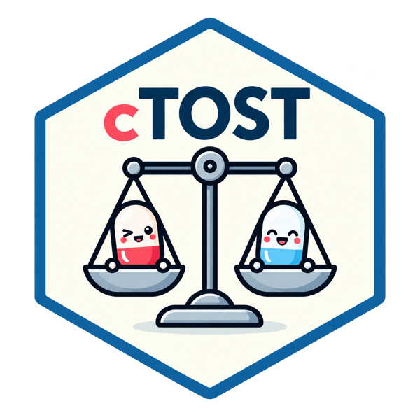
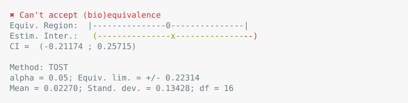
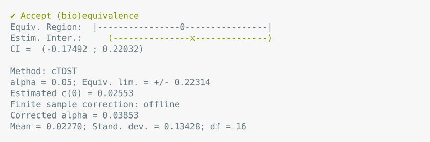
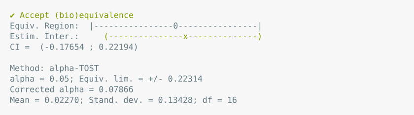
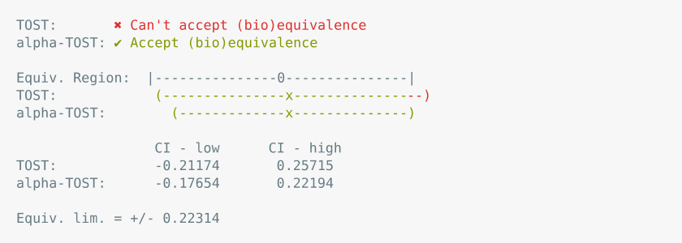
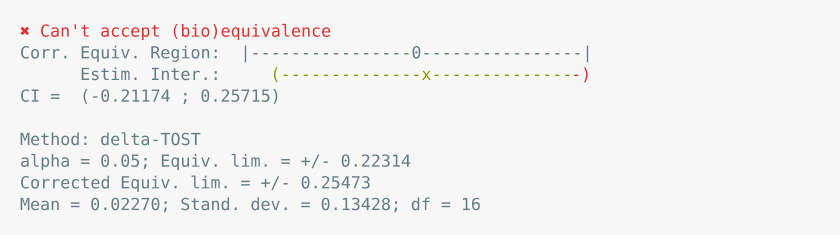
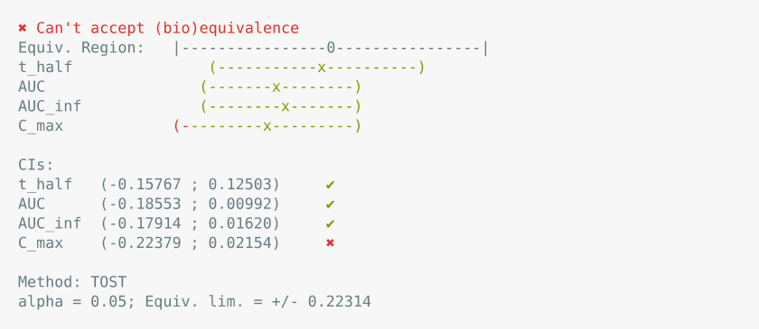
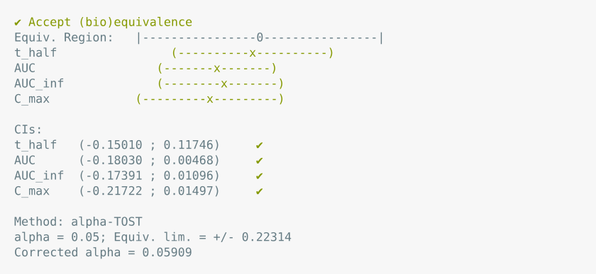

<!-- README.md is generated from README.Rmd. Please edit this file -->

# cTOST <a href="https://stephaneguerrier.github.io/cTOST/"></a>

<!-- badges: start -->

[](https://opensource.org/licenses/AGPL-3.0)
[](https://CRAN.R-project.org/package=cTOST)
[](https://github.com/stephaneguerrier/cTOST/actions/workflows/R-CMD-check.yaml)
[](https://www.r-pkg.org/pkg/cTOST)
[](https://www.r-pkg.org/pkg/cTOST)
<!-- badges: end -->

## Overview

The `cTOST` package provides **finite sample corrections** for
equivalence testing using the Two One-Sided Tests (TOST) procedure.
Unlike traditional hypothesis testing that aims to detect differences,
equivalence testing aims to demonstrate that two treatments are *similar
enough* to be considered equivalent.

### Key Features

- **Finite sample corrections**: alpha-TOST, delta-TOST, and optimal
  cTOST for improved power
- **Univariate and multivariate** equivalence testing
- **Quantile-based** equivalence testing for distribution tails
- **Differential privacy** equivalence testing for sensitive data
- Comprehensive **visualization** and **comparison** tools

### Methods Implemented

| Method | Reference | Description |
|----|----|----|
| **alpha-TOST** | Boulaguiem et al. (2024), [*Statistics in Medicine*](https://doi.org/10.1002/sim.9993) | Adjusts the significance level |
| **delta-TOST** | Boulaguiem et al. (2024), [*Statistics in Medicine*](https://doi.org/10.1002/sim.9993) | Adjusts the equivalence bounds |
| **Multivariate alpha-TOST and cTOST** | Boulaguiem et al. (2025), [*Statistics in Medicine*](https://doi.org/10.1002/sim.10258) | Several parameters tested jointly |
| **Optimal cTOST** | Insolia et al. (2025), [arXiv](https://arxiv.org/abs/2507.22756) | Best power (recommended) |
| **alpha-qTOST** | Wu et al. (2025), [arXiv](https://arxiv.org/abs/2510.17514) | Quantile-based testing |
| **DP-TOST** | Pareek et al. (2026), [arXiv](https://arxiv.org/abs/2604.06499) | Differential privacy |

Full references are given at the [end of this page](#7-references).

## Installation

The `cTOST` package is available on cran and on GitHub. The version on
GitHub is subject to ongoing updates that may lead to stability issues.

The package can from cran as follows:

``` r
install.packages("cTOST")
```

The package can also be install from GitHub using the `devtools`
package:

``` r
install.packages("devtools")
devtools::install_github("stephaneguerrier/cTOST")
```

Note that Windows users are assumed that have Rtools installed (if this
is not the case, please visit this
[link](https://cran.r-project.org/bin/windows/Rtools/).

## Quick Start

Here are a few examples demonstrating the usage of the `cTOST` package.

### Univariate Equivalence Testing

To illustrate the use of the proposed method in the univariate settings,
we consider the `skin` dataset analyzed in Boulaguiem et al. (2024a),
which can be loaded as follows:

``` r
data(skin)
theta_hat = diff(apply(skin,2,mean))
nu = nrow(skin) - 1
sig_hat = var(apply(skin,1,diff))/nu
```

#### Standard TOST

The standard TOST can be used as follows:

``` r
stost = ctost(theta = theta_hat, sigma = sig_hat, nu = nu,
              delta = log(1.25), method = "unadjusted")
stost
```

<picture>
<source media="(prefers-color-scheme: dark)" srcset="man/figures/readme/tost-dark.svg">
 </picture>

#### Optimal cTOST

The cTOST can be used through the function `ctost` as follows:

``` r
opt_tost = ctost(theta = theta_hat, sigma = sig_hat, nu = nu,
              delta = log(1.25), method = "optimal")
opt_tost
```

<picture>
<source media="(prefers-color-scheme: dark)" srcset="man/figures/readme/ctost-dark.svg">

</picture>

#### Alpha-TOST

The $\alpha$-TOST can be used through the function `ctost` as follows:

``` r
atost = ctost(theta = theta_hat, sigma = sig_hat, nu = nu,
              delta = log(1.25), method = "alpha")
atost
```

<picture>
<source media="(prefers-color-scheme: dark)" srcset="man/figures/readme/atost-dark.svg">

</picture>

It is possible to compare the results of the $\alpha$-TOST (or
$\delta$-TOST, see below) with the standard TOST as follows:

``` r
compare_to_tost(atost)
```

<picture>
<source media="(prefers-color-scheme: dark)" srcset="man/figures/readme/compare-atost-dark.svg">

</picture>

#### Delta-TOST

The $\delta$-TOST can be used through the function `ctost` as follows:

``` r
dtost = ctost(theta = theta_hat, sigma = sig_hat, nu = nu,
              delta = log(1.25), method = "delta")
dtost
```

<picture>
<source media="(prefers-color-scheme: dark)" srcset="man/figures/readme/dtost-dark.svg">

</picture>

### Multivariate Equivalence Testing

``` r
data(ticlopidine)
n = nrow(ticlopidine)
p = ncol(ticlopidine)
nu = n-1
theta_hat = colMeans(ticlopidine)
Sigma_hat = cov(ticlopidine)/n
```

#### Standard Multivariate TOST

``` r
mtost = ctost(theta = theta_hat, sigma = Sigma_hat, nu = nu,
              delta = log(1.25), method = "unadjusted")
mtost
```

<picture>
<source media="(prefers-color-scheme: dark)" srcset="man/figures/readme/mtost-dark.svg">

</picture>

#### Multivariate Alpha-TOST

``` r
matost = ctost(theta = theta_hat, sigma = Sigma_hat, nu = nu, delta = log(1.25),
               method = "alpha")
matost
```

<picture>
<source media="(prefers-color-scheme: dark)" srcset="man/figures/readme/matost-dark.svg">

</picture>

## 4. Learn More

For detailed guides and examples, see the package vignettes:

- **[Getting
  Started](https://stephaneguerrier.github.io/cTOST/articles/getting-started.html)** -
  Quick introduction and basic usage
- **[Average Equivalence:
  Univariate](https://stephaneguerrier.github.io/cTOST/articles/average-equivalence-univariate.html)** -
  In-depth guide to univariate testing
- **[Average Equivalence:
  Multivariate](https://stephaneguerrier.github.io/cTOST/articles/average-equivalence-multivariate.html)** -
  Multivariate testing with examples
- **[Quantile Equivalence
  Testing](https://stephaneguerrier.github.io/cTOST/articles/quantile-equivalence.html)** -
  Testing at specific quantiles
- **[Differential Privacy
  Testing](https://stephaneguerrier.github.io/cTOST/articles/dp-equivalence.html)** -
  Equivalence testing for sensitive data
- **[Mathematical
  Background](https://stephaneguerrier.github.io/cTOST/articles/mathematical-background.html)** -
  Theory and mathematical details

Or browse the [full reference
documentation](https://stephaneguerrier.github.io/cTOST/reference/index.html).

## 5. How to cite

    @Manual{boulaguiem2024ctost,
      title = {cTOST: Finite Sample Correction of The TOST in The Univariate Framework},
      author = {Boulaguiem, Y. and Insolia, L. and Couturier, D.-L. and Guerrier, S.},
      year = {2024},
      note = {R package version 1.1.0},
      url = {https://github.com/stephaneguerrier/cTOST},
    }

## 6. License

The license this source code is released under is the GNU AFFERO GENERAL
PUBLIC LICENSE (AGPL) v3.0. Please see the LICENSE file for full text.
Otherwise, please consult
[GNU](https://www.gnu.org/licenses/agpl-3.0.en.html) which will provide
a synopsis of the restrictions placed upon the code.

## 7. References

Boulaguiem, Y., Quartier, J., Lapteva, M., Kalia, Y. N., Victoria-Feser,
M.-P., Guerrier, S. & Couturier, D.-L. (2024). *Finite sample
adjustments for average equivalence testing*. **Statistics in
Medicine**, 43(5), 833–854.
[doi:10.1002/sim.9993](https://doi.org/10.1002/sim.9993)

Boulaguiem, Y., Insolia, L., Victoria-Feser, M.-P., Couturier, D.-L. &
Guerrier, S. (2025). *Multivariate adjustments for average equivalence
testing*. **Statistics in Medicine**, 44(15–17).
[doi:10.1002/sim.10258](https://doi.org/10.1002/sim.10258)

Insolia, L., Ma, Y., Boulaguiem, Y. & Guerrier, S. (2025).
*Bioequivalence assessment for locally acting drugs: a framework for
feasible and efficient evaluation*. **arXiv** preprint.
[arXiv:2507.22756](https://arxiv.org/abs/2507.22756)

Wu, J., Guerrier, S., Gou, S., Kalia, Y. N. & Insolia, L. (2025).
*Bridging the gap between experimental burden and statistical power for
quantiles equivalence testing*. **arXiv** preprint.
[arXiv:2510.17514](https://arxiv.org/abs/2510.17514)

Pareek, S., Insolia, L., Molinari, R. & Guerrier, S. (2026).
*Equivalence testing under privacy constraints*. **arXiv** preprint.
[arXiv:2604.06499](https://arxiv.org/abs/2604.06499)
