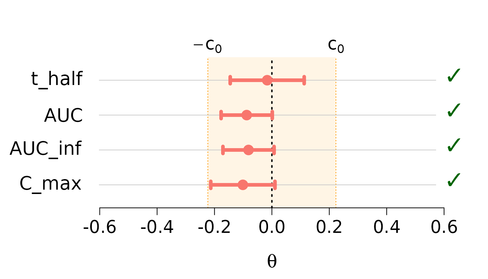
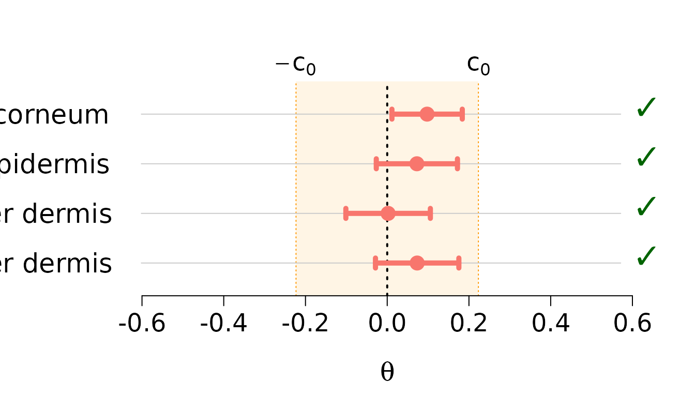

# Average Equivalence Testing: Multivariate

## Introduction

This vignette extends univariate equivalence testing to the
**multivariate** setting, where we test equivalence simultaneously
across multiple parameters. This is common in:

- **Bioequivalence studies** with multiple pharmacokinetic parameters
  (AUC, C_max, t_half, etc.)
- **Multivariate bioequivalence** across different tissue layers or time
  points
- **Quality control** with multiple product characteristics

### The Multivariate Problem

Instead of a single parameter $`\theta`$, we now have a vector of
parameters $`\boldsymbol{\theta} = (\theta_1, \ldots, \theta_p)^T`$. We
want to test whether **all** parameters simultaneously fall within their
respective equivalence regions.

### Available Methods

For multivariate testing,
[`ctost()`](https://stephaneguerrier.github.io/cTOST/reference/ctost.md)
supports:

1.  **Unadjusted TOST** (`method = "unadjusted"`): Standard multivariate
    TOST
2.  **Alpha-TOST** (`method = "alpha"`): Adjusts significance level
    (Boulaguiem et al. 2025)
3.  **Optimal cTOST** (`method = "optimal"`): **Recommended** - Best
    power (Insolia et al. 2025)

**Note:** Delta-TOST is **not implemented** for multivariate settings
due to poor finite sample performance.

## Statistical Framework

### Model Setup

We assume:

``` math
\hat{\boldsymbol{\theta}} \sim N_p(\boldsymbol{\theta}, \boldsymbol{\Sigma}_\nu), \quad \nu \frac{\hat{\boldsymbol{\Sigma}}_\nu}{\boldsymbol{\Sigma}_\nu} \sim W_p(\nu, \mathbf{I}_p)
```

where:

- $`\hat{\boldsymbol{\theta}}`$ is the $`p`$-dimensional vector of
  estimated mean differences
- $`\boldsymbol{\Sigma}_\nu`$ is the $`p \times p`$ covariance matrix
- $`\nu`$ is the degrees of freedom
- $`W_p`$ denotes the Wishart distribution

### Hypotheses

The multivariate hypotheses test whether all parameters are
simultaneously within the equivalence region:

``` math
H_0: \exists\, i \in \{1,\ldots,p\} \text{ such that } |\theta_i| \geq \delta \quad \text{vs.} \quad H_1: |\theta_i| < \delta \text{ for all } i
```

### Decision Rule

We accept equivalence if the $`(1-2\alpha)`$ confidence region for
$`\boldsymbol{\theta}`$ is entirely contained in the multivariate
equivalence region $`(-\delta, \delta)^p`$.

## Example 1: Pharmacokinetic Parameters

We use the `ticlopidine` dataset containing pharmacokinetic parameters
from a bioequivalence study.

### Load and Explore Data

``` r

data(ticlopidine)
dim(ticlopidine)
#> [1] 20  4
head(ticlopidine)
#>        t_half         AUC     AUC_inf       C_max
#> 1 -0.53754869 -0.27634036 -0.35181658 -0.11308276
#> 2  0.59089709  0.27355003  0.32736142  0.36251520
#> 3  0.14547051  0.12543294  0.14683852  0.16868248
#> 4 -0.60282454 -0.46041725 -0.49165900 -0.67511707
#> 5 -0.08664339 -0.09831984 -0.07991007 -0.32912619
#> 6 -0.34985932 -0.33778740 -0.35680878 -0.02673381
summary(ticlopidine)
#>      t_half              AUC              AUC_inf             C_max         
#>  Min.   :-0.60282   Min.   :-0.46042   Min.   :-0.49166   Min.   :-0.75115  
#>  1st Qu.:-0.25599   1st Qu.:-0.27976   1st Qu.:-0.25310   1st Qu.:-0.26242  
#>  Median : 0.03283   Median :-0.14554   Median :-0.11938   Median :-0.09968  
#>  Mean   :-0.01632   Mean   :-0.08781   Mean   :-0.08147   Mean   :-0.10113  
#>  3rd Qu.: 0.20462   3rd Qu.: 0.09560   3rd Qu.: 0.09409   3rd Qu.: 0.16044  
#>  Max.   : 0.59090   Max.   : 0.55419   Max.   : 0.51747   Max.   : 0.48128
```

The dataset contains 20 observations of 4 pharmacokinetic parameters:

- `t_half`: Half-life
- `AUC`: Area under the concentration-time curve
- `AUC_inf`: AUC extrapolated to infinity
- `C_max`: Maximum concentration

### Visualize the Data

``` r

# Pairwise scatterplot matrix
pairs(ticlopidine,
      main = "Ticlopidine: Pairwise Relationships",
      pch = 16, col = rgb(0, 0, 0, 0.5))
```


The parameters show positive correlations, which the multivariate test
accounts for through the covariance structure.

### Compute Test Statistics

``` r

# Sample size and dimensions
n <- nrow(ticlopidine)
p <- ncol(ticlopidine)
nu <- n - 1

# Multivariate statistics
theta_hat <- colMeans(ticlopidine)
Sigma_hat <- cov(ticlopidine) / n

# Display results
cat("Sample size:", n, "\n")
#> Sample size: 20
cat("Number of parameters:", p, "\n")
#> Number of parameters: 4
cat("Degrees of freedom:", nu, "\n\n")
#> Degrees of freedom: 19

cat("Estimated differences:\n")
#> Estimated differences:
print(round(theta_hat, 4))
#>  t_half     AUC AUC_inf   C_max 
#> -0.0163 -0.0878 -0.0815 -0.1011

cat("\nEstimated covariance matrix:\n")
#> 
#> Estimated covariance matrix:
print(round(Sigma_hat, 6))
#>           t_half      AUC  AUC_inf    C_max
#> t_half  0.006682 0.001924 0.002415 0.001707
#> AUC     0.001924 0.003194 0.003145 0.003388
#> AUC_inf 0.002415 0.003145 0.003191 0.003193
#> C_max   0.001707 0.003388 0.003193 0.005032
```

### Run Multivariate Tests

#### Standard Multivariate TOST

``` r

mv_standard <- ctost(
  theta = theta_hat,
  sigma = Sigma_hat,
  nu = nu,
  delta = log(1.25),
  alpha = 0.05,
  method = "unadjusted"
)

print(mv_standard)
#> ✖ Can't accept (bio)equivalence
#> Equiv. Region:   |----------------0----------------|
#> t_half               (-----------x----------)       
#> AUC                 (-------x--------)              
#> AUC_inf             (--------x-------)              
#> C_max            (---------x---------)              
#> 
#> CIs:
#> t_half   (-0.15767 ; 0.12503)
#> ✔
#> AUC      (-0.18553 ; 0.00992)
#> ✔
#> AUC_inf  (-0.17914 ; 0.01620)
#> ✔
#> C_max    (-0.22379 ; 0.02154)
#> ✖
#> 
#> Method: TOST
#> alpha = 0.05; Equiv. lim. = +/- 0.22314
```

#### Alpha-TOST

``` r

mv_alpha <- ctost(
  theta = theta_hat,
  sigma = Sigma_hat,
  nu = nu,
  delta = log(1.25),
  alpha = 0.05,
  method = "alpha"
)

print(mv_alpha)
#> ✔ Accept (bio)equivalence
#> Equiv. Region:   |----------------0----------------|
#> t_half                (----------x----------)       
#> AUC                 (-------x-------)               
#> AUC_inf             (--------x-------)              
#> C_max            (---------x---------)              
#> 
#> CIs:
#> t_half   (-0.15011 ; 0.11747)
#> ✔
#> AUC      (-0.18031 ; 0.00469)
#> ✔
#> AUC_inf  (-0.17392 ; 0.01097)
#> ✔
#> C_max    (-0.21723 ; 0.01498)
#> ✔
#> 
#> Method: alpha-TOST
#> alpha = 0.05; Equiv. lim. = +/- 0.22314
#> Corrected alpha = 0.05908
cat("\nCorrected alpha:", round(mv_alpha$corrected_alpha, 4), "\n")
#> 
#> Corrected alpha: 0.0591
```

#### Optimal cTOST (Recommended)

``` r

mv_optimal <- ctost(
  theta = theta_hat,
  sigma = Sigma_hat,
  nu = nu,
  delta = log(1.25),
  alpha = 0.05,
  method = "optimal"
)

print(mv_optimal)
#> ✔ Accept (bio)equivalence
#> Equiv. Region:   |----------------0----------------|
#> t_half                (----------x----------)       
#> AUC                 (-------x-------)               
#> AUC_inf              (-------x-------)              
#> C_max             (--------x---------)              
#> 
#> CIs:
#> t_half   (-0.14520 ; 0.11256)
#> ✔
#> AUC      (-0.17694 ; 0.00132)
#> ✔
#> AUC_inf  (-0.17055 ; 0.00761)
#> ✔
#> C_max    (-0.21300 ; 0.01075)
#> ✔
#> 
#> Method: cTOST
#> alpha = 0.05; Equiv. lim. = +/- 0.22314
```

### Visualize Results

The [`plot()`](https://rdrr.io/r/graphics/plot.default.html) function
creates a forest plot showing confidence intervals for each parameter.
For multivariate tests, plot each method separately:

``` r

plot(mv_optimal)
```



**Interpretation of results:**

- Each parameter has its own confidence interval
- All parameters must satisfy equivalence for overall acceptance
- The optimal cTOST provides the most powerful test

**Key observation:** All parameters satisfy equivalence individually,
and the overall test accepts equivalence.

## Example 2: Skin Layer Analysis

The `skin_mvt` dataset contains measurements across multiple skin
layers.

### Load and Explore Data

``` r

data(skin_mvt)
dim(skin_mvt)
#> [1] 12  4
head(skin_mvt)
#>        stratum corneum viable epidermis upper dermis lower dermis
#> Obs. 1      -1.7104174       0.05818599  -0.08715513   0.00367359
#> Obs. 2      -0.7116083      -0.02268176  -0.01893823   0.02323575
#> Obs. 3      -0.5985133      -0.85824833  -1.56784563  -0.74866774
#> Obs. 4       0.7194425      -0.01237893  -0.22736451  -0.12790074
#> Obs. 5      -1.3857837      -1.03882408  -0.44155379  -0.77963489
#> Obs. 6       0.6708900       0.99272839   1.00026426   0.73961930
colnames(skin_mvt)
#> [1] "stratum corneum"  "viable epidermis" "upper dermis"     "lower dermis"
```

The dataset has 12 observations across 4 skin layers.

### Compute Test Statistics

``` r

n <- nrow(skin_mvt)
p <- ncol(skin_mvt)
nu <- n - 1

theta_hat <- apply(skin_mvt, 2, mean)
Sigma_hat <- cov(skin_mvt) / n

cat("Sample size:", n, "\n")
#> Sample size: 12
cat("Number of layers:", p, "\n\n")
#> Number of layers: 4

cat("Mean differences by layer:\n")
#> Mean differences by layer:
print(round(theta_hat, 4))
#>  stratum corneum viable epidermis     upper dermis     lower dermis 
#>           0.0976           0.0726           0.0022           0.0733
```

### Run Analysis

``` r

skin_optimal <- ctost(
  theta = theta_hat,
  sigma = Sigma_hat,
  nu = nu,
  delta = log(1.25),
  alpha = 0.05,
  method = "optimal"
)

print(skin_optimal)
#> ✔ Accept (bio)equivalence
#> Equiv. Region:   |----------------0----------------|
#> stratum corneum                  (-------x------)   
#> viable epidermis              (--------x--------)   
#> upper dermis             (--------x--------)        
#> lower dermis                  (--------x--------)   
#> 
#> CIs:
#> stratum corneum   (0.01153 ; 0.18369)
#> ✔
#> viable epidermis  (-0.02672 ; 0.17188)
#> ✔
#> upper dermis      (-0.10118 ; 0.10559)
#> ✔
#> lower dermis      (-0.02873 ; 0.17531)
#> ✔
#> 
#> Method: cTOST
#> alpha = 0.05; Equiv. lim. = +/- 0.22314
```

### Visualize by Layer

``` r

plot(skin_optimal,
     plot_params = list(var_names = colnames(skin_mvt)))
```



## Understanding Multivariate Corrections

### Why Multivariate Testing is More Conservative

Testing multiple parameters simultaneously is inherently more
conservative because:

1.  **Multiple comparisons**: Need to control family-wise error rate
2.  **Correlation structure**: Parameters are often correlated
3.  **Finite samples**: Conservative bias compounds across dimensions

### Correction Methods

The finite sample corrections of the significance level
(`correction = "offline"` or `"bootstrap"`) are available for the
univariate cTOST only. In multivariate settings
[`ctost()`](https://stephaneguerrier.github.io/cTOST/reference/ctost.md)
uses `correction = "none"`; asking for another value produces a warning
and no correction:

``` r

mv_none <- ctost(
  theta = theta_hat,
  sigma = Sigma_hat,
  nu = nu,
  delta = log(1.25),
  method = "optimal",
  correction = "none"
)
cat("Decision:", mv_none$decision, "\n")
#> Decision: TRUE TRUE TRUE TRUE
```

## Practical Guidelines

### When to Use Multivariate Testing

Use multivariate equivalence testing when:

1.  **Multiple related outcomes** must all satisfy equivalence
2.  **Regulatory requirements** specify simultaneous testing
3.  **Composite endpoints** are scientifically relevant

### Choosing Between Univariate and Multivariate

**Multivariate testing** is appropriate when:

- Parameters are **scientifically related**
- **All must be equivalent** for practical equivalence
- Example: All PK parameters in bioequivalence

**Multiple univariate tests** may be appropriate when:

- Parameters are **conceptually separate**
- **Any one** being equivalent is meaningful
- Example: Different efficacy measures in clinical trials

### Sample Size Considerations

Multivariate testing requires **larger sample sizes** than univariate
testing because:

- More parameters to estimate
- Covariance structure adds complexity
- Conservative adjustments for multiple testing

**Rule of thumb:** For $`p`$ parameters, aim for $`n \geq 10p`$ or
larger.

### Interpreting Results

#### Component-wise Decisions

The `decision` vector shows which individual parameters satisfy
equivalence:

``` r

cat("Individual parameter decisions:\n")
#> Individual parameter decisions:
print(mv_optimal$decision)
#>  t_half     AUC AUC_inf   C_max 
#>    TRUE    TRUE    TRUE    TRUE
```

#### Overall Decision

The overall decision requires **all** components to satisfy equivalence:

``` r

overall_decision <- all(mv_optimal$decision)
cat("Overall equivalence accepted:", overall_decision, "\n")
#> Overall equivalence accepted: TRUE
```

## Comparison with Univariate Tests

It’s instructive to compare multivariate testing with performing
separate univariate tests:

``` r

# Univariate tests for each parameter
univariate_results <- sapply(1:p, function(i) {
  uni_test <- ctost(
    theta = theta_hat[i],
    sigma = Sigma_hat[i, i],
    nu = nu,
    delta = log(1.25),
    alpha = 0.05,
    method = "optimal"
  )
  uni_test$decision
})

cat("Univariate decisions (ignoring correlations):\n")
#> Univariate decisions (ignoring correlations):
print(univariate_results)
#>  stratum corneum viable epidermis     upper dermis     lower dermis 
#>            FALSE            FALSE             TRUE            FALSE

cat("\nMultivariate decisions (accounting for correlations):\n")
#> 
#> Multivariate decisions (accounting for correlations):
print(mv_optimal$decision)
#>  t_half     AUC AUC_inf   C_max 
#>    TRUE    TRUE    TRUE    TRUE
```

**Key difference:** The multivariate test properly accounts for
correlations between parameters.

## Advanced Topics

### Custom Equivalence Margins

While we’ve used $`\delta = \log(1.25)`$ for all parameters, you can
specify different margins:

``` r

# Different margin for each parameter (not currently supported)
# Future extension may allow parameter-specific margins
```

**Current limitation:** The package assumes the same $`\delta`$ for all
parameters.

### Visualizing Multivariate Confidence Regions

For $`p = 2`$ parameters, we can visualize the bivariate confidence
region:

``` r

# Bivariate confidence ellipse (example code)
# This requires additional packages and is shown for illustration
library(ellipse)

# Extract first two parameters
theta_12 <- theta_hat[1:2]
Sigma_12 <- Sigma_hat[1:2, 1:2]

# Plot equivalence region
delta <- log(1.25)
plot(c(-delta, delta), c(-delta, delta), type = "n",
     xlab = names(theta_hat)[1],
     ylab = names(theta_hat)[2],
     main = "Bivariate Confidence Region")
rect(-delta, -delta, delta, delta, col = rgb(0, 1, 0, 0.2), border = NA)

# Add confidence ellipse
lines(ellipse(Sigma_12, centre = theta_12, level = 0.90))
points(theta_12[1], theta_12[2], pch = 16, cex = 1.5)
```

## Summary

- **Multivariate equivalence testing** tests all parameters
  simultaneously
- Use `method = "optimal"` (the cTOST) for best performance
- The test accounts for **correlations** between parameters
- Larger sample sizes are needed compared to univariate testing
- All parameters must satisfy equivalence for overall acceptance
- Visualize results with
  [`plot()`](https://rdrr.io/r/graphics/plot.default.html) to see
  parameter-specific intervals

## References

For theoretical details on multivariate equivalence testing:

- Boulaguiem et al. (2025) for multivariate alpha-TOST
- Insolia et al. (2025) for optimal multivariate cTOST

For related topics, see:

- **Average Equivalence Testing: Univariate** vignette for
  single-parameter testing
- **Mathematical Background** vignette for detailed theory

Boulaguiem, Younes, Luca Insolia, Maria-Pia Victoria-Feser,
Dominique-Laurent Couturier, and Stéphane Guerrier. 2025. “Multivariate
Adjustments for Average Equivalence Testing.” *Statistics in Medicine*
44 (15-17). <https://doi.org/10.1002/sim.10258>.

Insolia, Luca, Yanyuan Ma, Younes Boulaguiem, and Stéphane Guerrier.
2025. *Bioequivalence Assessment for Locally Acting Drugs: A Framework
for Feasible and Efficient Evaluation*.
<https://doi.org/10.48550/arXiv.2507.22756>.
