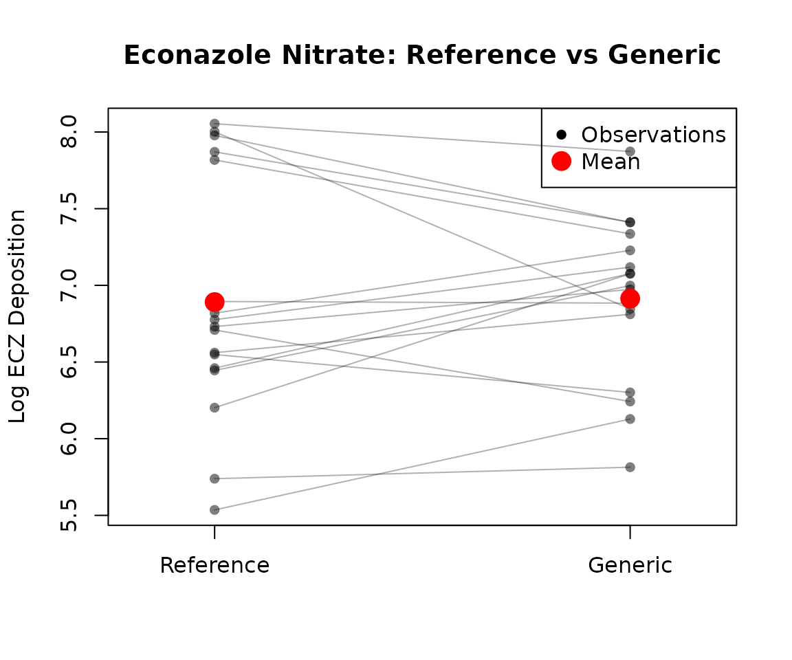
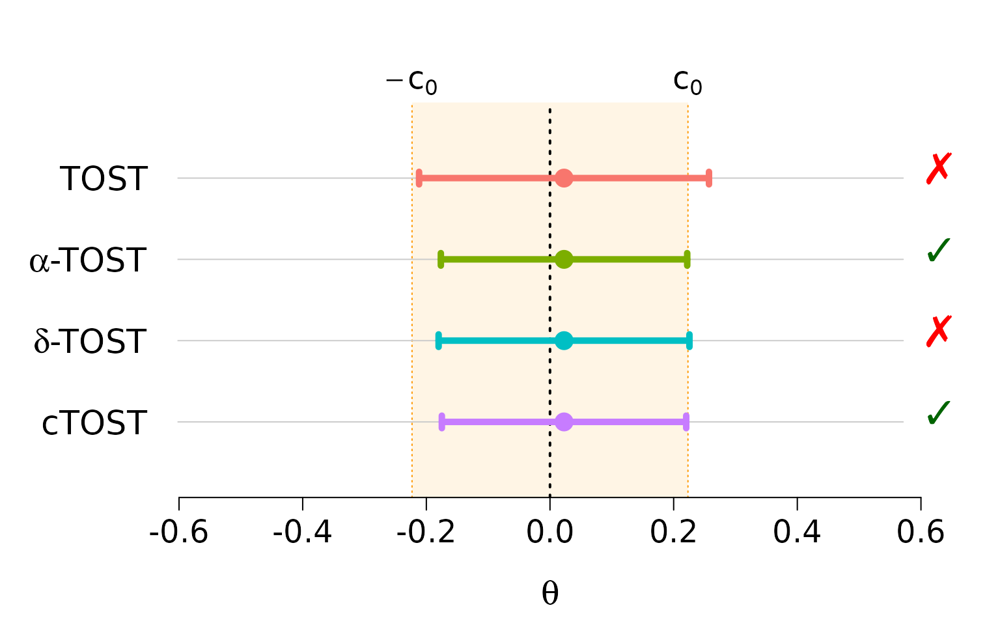

# Average Equivalence Testing: Univariate

## Introduction

This vignette provides an in-depth guide to univariate average
equivalence testing using the `cTOST` package. We focus on testing
whether the mean difference between two treatments falls within a
pre-specified equivalence margin.

### The Problem

In bioequivalence studies and many other applications, the goal is to
demonstrate that two treatments produce **equivalent** average
responses. For example:

- Is a generic drug equivalent to a brand-name drug?
- Are two manufacturing processes equivalent?
- Are two measurement devices equivalent?

The equivalence region is typically $`(-\delta, \delta)`$, where
$`\delta`$ is chosen based on scientific or regulatory criteria. For
bioequivalence studies, FDA guidelines often use
$`\delta = \log(1.25) \approx 0.223`$.

### Available Methods

The
[`ctost()`](https://stephaneguerrier.github.io/cTOST/reference/ctost.md)
function implements four methods:

1.  **Unadjusted TOST** (`method = "unadjusted"`): Standard two
    one-sided tests
2.  **Alpha-TOST** (`method = "alpha"`): Adjusts the significance level
    (Boulaguiem et al. 2023)
3.  **Delta-TOST** (`method = "delta"`): Adjusts the equivalence bounds
    (Boulaguiem et al. 2023)
4.  **Optimal cTOST** (`method = "optimal"`): **Recommended** - Provides
    best power (Insolia et al. 2025)

## Statistical Framework

### Model Setup

We assume the canonical form for average equivalence testing:

``` math
\hat{\theta} \sim N(\theta, \sigma^2_\nu), \quad \nu \frac{\hat{\sigma}^2_\nu}{\sigma^2_\nu} \sim \chi^2_\nu
```

where:

- $`\hat{\theta}`$ is the estimated mean difference
- $`\sigma^2_\nu`$ is the variance of $`\hat{\theta}`$
- $`\nu`$ is the degrees of freedom

### Hypotheses

``` math
H_0: \theta \notin (-\delta, \delta) \quad \text{vs.} \quad H_1: \theta \in (-\delta, \delta)
```

We reject $`H_0`$ (accept equivalence) if the $`(1-2\alpha)`$ confidence
interval for $`\theta`$ is entirely contained in $`(-\delta, \delta)`$.

### The Conservativeness Problem

The standard TOST is known to be **conservative** in finite samples,
meaning:

- The actual type I error rate is **less than** the nominal $`\alpha`$
- This leads to **reduced power** (harder to accept equivalence)
- The problem is worse for:
  - Small sample sizes
  - Large variability relative to the equivalence margin

The corrected methods (alpha-TOST, delta-TOST, optimal cTOST) address
this issue.

## Real Data Example: Econazole Nitrate Study

We use the `skin` dataset from Quartier et al. (2019), which contains
measurements of econazole nitrate deposition from a reference and
generic cream product on porcine skin.

### Load and Explore Data

``` r

data(skin)
dim(skin)
#> [1] 17  2
head(skin)
#>       Reference  Generic
#> Obs.1  5.739053 5.813981
#> Obs.2  6.560818 6.811332
#> Obs.3  6.731042 6.973451
#> Obs.4  5.535548 6.128285
#> Obs.5  6.548992 6.301647
#> Obs.6  6.445193 6.998245
summary(skin)
#>    Reference        Generic     
#>  Min.   :5.536   Min.   :5.814  
#>  1st Qu.:6.460   1st Qu.:6.811  
#>  Median :6.731   Median :6.998  
#>  Mean   :6.891   Mean   :6.914  
#>  3rd Qu.:7.818   3rd Qu.:7.228  
#>  Max.   :8.054   Max.   :7.873
```

The data contains 17 paired observations. Let’s visualize the raw data:

``` r

# Paired plot
plot(1:2, type = "n", xlim = c(0.8, 2.2), ylim = range(skin),
     xlab = "", ylab = "Log ECZ Deposition",
     main = "Econazole Nitrate: Reference vs Generic",
     xaxt = "n")
axis(1, at = c(1, 2), labels = c("Reference", "Generic"))

# Connect paired observations
for (i in 1:nrow(skin)) {
  lines(c(1, 2), skin[i, ], col = rgb(0, 0, 0, 0.3))
  points(c(1, 2), skin[i, ], pch = 16, col = rgb(0, 0, 0, 0.5))
}

# Add means
points(c(1, 2), apply(skin, 2, mean), pch = 16, col = "red", cex = 2)
legend("topright", legend = c("Observations", "Mean"),
       col = c("black", "red"), pch = 16, pt.cex = c(1, 2))
```



### Compute Test Statistics

For paired data, we compute the mean difference and its standard error:

``` r

# Mean difference (Generic - Reference)
theta_hat <- diff(apply(skin, 2, mean))

# Sample size and degrees of freedom
n <- nrow(skin)
nu <- n - 1

# Variance of mean difference
differences <- apply(skin, 1, diff)
sig_hat <- var(differences) / nu

# Summary
cat("Sample size:", n, "\n")
#> Sample size: 17
cat("Degrees of freedom:", nu, "\n")
#> Degrees of freedom: 16
cat("Estimated difference (Generic - Reference):", round(theta_hat, 4), "\n")
#> Estimated difference (Generic - Reference): 0.0227
cat("Standard error:", round(sqrt(sig_hat), 4), "\n")
#> Standard error: 0.1343
cat("Variance:", round(sig_hat, 4), "\n")
#> Variance: 0.018
```

The positive difference suggests the Generic product delivers slightly
more econazole than the Reference on average.

### Define Equivalence Margin

For bioequivalence, the FDA typically uses a $`\pm 20\%`$ margin on the
original scale, which translates to $`\log(1.25)`$ on the log scale:

``` r

delta <- log(1.25)
cat("Equivalence margin:", round(delta, 4), "\n")
#> Equivalence margin: 0.2231
cat("Equivalence region: [", round(-delta, 4), ",", round(delta, 4), "]\n")
#> Equivalence region: [ -0.2231 , 0.2231 ]
```

## Method Comparison

Let’s compare all four methods:

### 1. Standard TOST (Unadjusted)

``` r

standard_tost <- ctost(
  theta = theta_hat,
  sigma = sig_hat,
  nu = nu,
  delta = delta,
  alpha = 0.05,
  method = "unadjusted"
)

print(standard_tost)
#> ✖ Can't accept (bio)equivalence
#> Equiv. Region:  |---------------0---------------|  
#> Estim. Inter.:   (---------------x----------------)
#> CI =  (-0.21174 ; 0.25715)
#> 
#> Method: TOST
#> alpha = 0.05; Equiv. lim. = +/- 0.22314
#> Mean = 0.02270; Stand. dev. = 0.13428; df = 16
```

### 2. Alpha-TOST

The alpha-TOST increases the significance level to account for
conservativeness:

``` r

alpha_tost <- ctost(
  theta = theta_hat,
  sigma = sig_hat,
  nu = nu,
  delta = delta,
  alpha = 0.05,
  method = "alpha"
)

print(alpha_tost)
#> ✔ Accept (bio)equivalence
#> Equiv. Region:  |----------------0----------------|
#> Estim. Inter.:     (---------------x--------------)
#> CI =  (-0.17654 ; 0.22194)
#> 
#> Method: alpha-TOST
#> alpha = 0.05; Equiv. lim. = +/- 0.22314
#> Corrected alpha = 0.07866
#> Mean = 0.02270; Stand. dev. = 0.13428; df = 16
cat("\nCorrected alpha:", round(alpha_tost$corrected_alpha, 4), "\n")
#> 
#> Corrected alpha: 0.0787
```

### 3. Delta-TOST

The delta-TOST enlarges the equivalence bounds (the TOST is
conservative, so the corrected margin is always at least as large as the
nominal one):

``` r

delta_tost <- ctost(
  theta = theta_hat,
  sigma = sig_hat,
  nu = nu,
  delta = delta,
  alpha = 0.05,
  method = "delta"
)

print(delta_tost)
#> ✖ Can't accept (bio)equivalence
#> Corr. Equiv. Region:  |----------------0----------------|
#>       Estim. Inter.:     (--------------x---------------)
#> CI =  (-0.21174 ; 0.25715)
#> 
#> Method: delta-TOST
#> alpha = 0.05; Equiv. lim. = +/- 0.22314
#> Corrected Equiv. lim. = +/- 0.25473
#> Mean = 0.02270; Stand. dev. = 0.13428; df = 16
cat("\nCorrected delta:", round(delta_tost$corrected_delta, 4), "\n")
#> 
#> Corrected delta: 0.2547
```

### 4. Optimal cTOST (Recommended)

The optimal method provides the best power while maintaining type I
error control:

``` r

optimal_tost <- ctost(
  theta = theta_hat,
  sigma = sig_hat,
  nu = nu,
  delta = delta,
  alpha = 0.05,
  method = "optimal"
)

print(optimal_tost)
#> ✔ Accept (bio)equivalence
#> Equiv. Region:  |----------------0----------------|
#> Estim. Inter.:     (---------------x--------------)
#> CI =  (-0.17492 ; 0.22032)
#> 
#> Method: cTOST
#> alpha = 0.05; Equiv. lim. = +/- 0.22314
#> Estimated c(0) = 0.02553
#> Finite sample correction: offline
#> Corrected alpha = 0.03853
#> Mean = 0.02270; Stand. dev. = 0.13428; df = 16
```

### Visual Comparison

``` r

plot(standard_tost, alpha_tost, delta_tost, optimal_tost)
```



**Interpretation:**

- The alpha-TOST and the cTOST **accept equivalence**, while the
  standard TOST and the delta-TOST do not
- The alpha-TOST and the cTOST produce **narrower confidence
  intervals**; the delta-TOST keeps the TOST interval and widens the
  equivalence region instead
- The optimal cTOST provides the most efficient inference

### Compare to Standard TOST

Use
[`compare_to_tost()`](https://stephaneguerrier.github.io/cTOST/reference/compare_to_tost.md)
to see the improvement:

``` r

compare_to_tost(alpha_tost)
#> TOST:
#> ✖ Can't accept (bio)equivalence
#> alpha-TOST:
#> ✔ Accept (bio)equivalence
#> 
#> Equiv. Region:  |---------------0---------------|  
#> TOST:            (---------------x----------------)
#> alpha-TOST:        (-------------x--------------)  
#> 
#>                  CI - low      CI - high
#> TOST:            -0.21174       0.25715
#> alpha-TOST:      -0.17654       0.22194
#> 
#> Equiv. lim. = +/- 0.22314
```

## Finite Sample Corrections

### When Are Corrections Important?

Finite sample corrections are most beneficial when:

1.  **Small sample sizes** ($`n < 30`$)
2.  **High variability** relative to the equivalence margin
3.  **Marginal decisions** (close to the boundary)

### Correction Options

The `correction` parameter controls additional adjustments for the
optimal cTOST:

- `"offline"` (default for univariate): Uses pre-computed corrections
- `"bootstrap"`: Uses bootstrap resampling
- `"none"`: No additional correction

``` r

# With offline correction (default)
optimal_offline <- ctost(
  theta = theta_hat,
  sigma = sig_hat,
  nu = nu,
  delta = delta,
  method = "optimal",
  correction = "offline"
)

# Without correction
optimal_none <- ctost(
  theta = theta_hat,
  sigma = sig_hat,
  nu = nu,
  delta = delta,
  method = "optimal",
  correction = "none"
)

cat("With correction:", optimal_offline$decision, "\n")
#> With correction: TRUE
cat("Without correction:", optimal_none$decision, "\n")
#> Without correction: TRUE
```

## Practical Guidelines

### Choosing a Method

**Recommended approach:**

1.  **Default**: Use `method = "optimal"` with `correction = "offline"`
2.  **Large samples** ($`n > 100`$): Any method works well
3.  **Small samples** ($`n < 30`$): Corrections are essential
4.  **Regulatory submissions**: Check if specific method is required

### Choosing Equivalence Margins

The equivalence margin $`\delta`$ should be chosen based on:

- **Clinical relevance**: What difference is scientifically meaningful?
- **Regulatory guidelines**: FDA/EMA guidance (e.g., $`\pm 20\%`$ for
  bioequivalence)
- **Historical data**: Previous studies in the same area

Common choices:

- Bioequivalence: $`\delta = \log(1.25) \approx 0.223`$
- Clinical trials: Often $`\delta = 0.5 \times \text{SD}`$ or smaller

### Sample Size Considerations

For a given equivalence margin and expected variability, you can
estimate the required sample size using:

``` r

# Example: Using PowerTOST package (not run)
library(PowerTOST)
sampleN.TOST(alpha = 0.05, targetpower = 0.8,
             theta0 = 0.95, theta1 = 0.8, theta2 = 1.25)
```

## Interpretation of Results

### Understanding the Output

A `ctost` object contains:

- `decision`: `TRUE` = equivalence accepted, `FALSE` = equivalence not
  accepted
- `ci`: Confidence interval for $`\theta`$
- `theta`: Point estimate
- `sigma`: Estimated variance
- `method`: Method used
- `corrected_alpha` or `corrected_delta`: Adjusted values (if
  applicable)

### Statistical vs. Clinical Significance

**Important:** Statistical equivalence does not automatically imply
clinical equivalence. Always consider:

- Is the equivalence margin clinically appropriate?
- Are there other relevant outcomes not tested?
- Is the study design appropriate for the research question?

## Summary

- Use **optimal cTOST** (`method = "optimal"`) for best performance
- Finite sample corrections are important for small samples
- Always visualize results with
  [`plot()`](https://rdrr.io/r/graphics/plot.default.html)
- Choose equivalence margins based on scientific/regulatory criteria
- Remember: equivalence testing requires a priori specification of
  $`\delta`$

## References

For more details on the methodology, see:

- Boulaguiem et al. (2023) for alpha-TOST and delta-TOST
- Insolia et al. (2025) for optimal cTOST
- Quartier et al. (2019) for the econazole data

For multivariate equivalence testing, see the **Average Equivalence
Testing: Multivariate** vignette.

Boulaguiem, Y., J. Quartier, M. Lapteva, et al. 2023. “Finite Sample
Adjustments for Average Equivalence Testing.” *Statistics in Medicine*,
2023–03.

Insolia, Luca, Yanyuan Ma, Younes Boulaguiem, and Stéphane Guerrier.
2025. *Bioequivalence Assessment for Locally Acting Drugs: A Framework
for Feasible and Efficient Evaluation*.
<https://doi.org/10.48550/arXiv.2507.22756>.

Quartier, J., N. Capony, M. Lapteva, and Y. N. Kalia. 2019. “Cutaneous
Biodistribution: A High-Resolution Methodology to Assess Bioequivalence
in Topical Skin Delivery.” *Pharmaceutics* 11 (9): 484.
