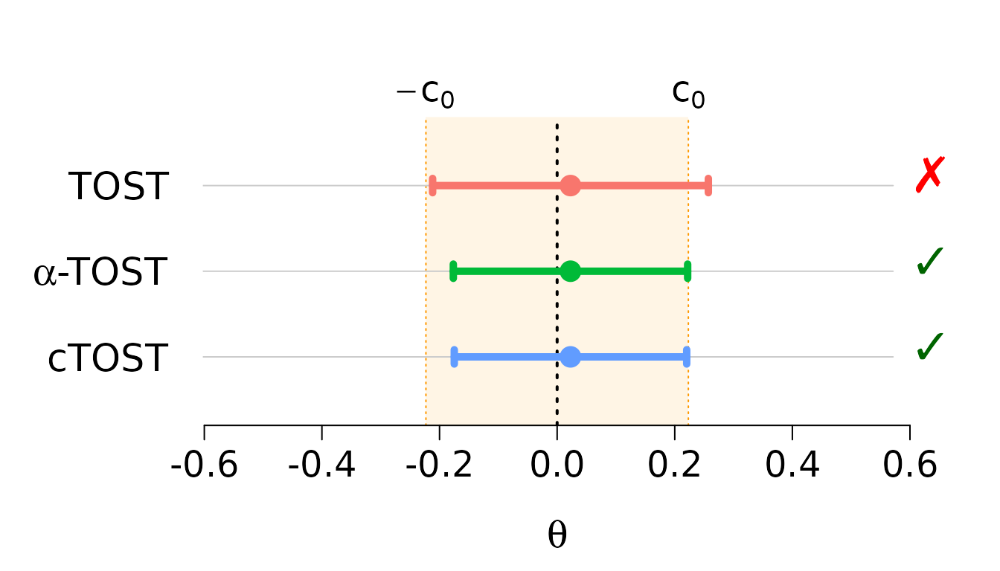

# Getting Started with cTOST

## Introduction

The `cTOST` package provides tools for **equivalence testing** using the
Two One-Sided Tests (TOST) procedure. Unlike traditional hypothesis
testing that aims to detect differences, equivalence testing aims to
demonstrate that two treatments are *similar enough* to be considered
equivalent.

**Key features:**

- **Finite sample corrections** for more accurate testing with small
  samples
- **Univariate and multivariate** equivalence testing
- **Quantile-based** equivalence testing
- **Differential privacy** equivalence testing for sensitive data

This vignette provides a quick start guide to using the main functions
in the package.

### Installation

``` r

# From CRAN
install.packages("cTOST")

# From GitHub (development version)
devtools::install_github("stephaneguerrier/cTOST")
```

## What is Equivalence Testing?

In many applications, especially bioequivalence studies for generic
drugs, we want to show that two treatments produce *equivalent* effects.
The equivalence region is typically defined as $`(-\delta, \delta)`$,
where $`\delta`$ is the **equivalence margin**.

**Key concepts:**

- **Null hypothesis**: The treatments are NOT equivalent (difference is
  outside $`[-\delta, \delta]`$)
- **Alternative hypothesis**: The treatments ARE equivalent (difference
  is inside $`[-\delta, \delta]`$)
- **Common equivalence margin**: $`\delta = \log(1.25)`$ in
  bioequivalence studies

## Basic Usage: Univariate TOST

Let’s start with a simple example using the built-in `skin` dataset,
which contains measurements of econazole nitrate delivery from a
reference product and a generic bioequivalent product.

### Load and Inspect Data

``` r

data(skin)
head(skin)
#>       Reference  Generic
#> Obs.1  5.739053 5.813981
#> Obs.2  6.560818 6.811332
#> Obs.3  6.731042 6.973451
#> Obs.4  5.535548 6.128285
#> Obs.5  6.548992 6.301647
#> Obs.6  6.445193 6.998245

# Sample size
n <- nrow(skin)
```

The dataset has 17 paired observations comparing a Reference and Generic
product.

### Compute Test Statistics

For a paired design, we compute the mean difference and its variance:

``` r

# Mean difference (Generic - Reference)
theta_hat <- diff(apply(skin, 2, mean))

# Degrees of freedom
nu <- n - 1

# Variance of the difference
sig_hat <- var(apply(skin, 1, diff)) / nu

cat("Estimated difference:", round(theta_hat, 4), "\n")
#> Estimated difference: 0.0227
cat("Estimated variance:", round(sig_hat, 4), "\n")
#> Estimated variance: 0.018
cat("Degrees of freedom:", nu, "\n")
#> Degrees of freedom: 16
```

### Run Standard TOST

The standard Two One-Sided Tests (TOST) can be performed using
[`ctost()`](https://stephaneguerrier.github.io/cTOST/reference/ctost.md)
with `method = "unadjusted"`:

``` r

# Equivalence margin (log(1.25) is standard for bioequivalence)
delta <- log(1.25)

# Standard TOST (unadjusted)
standard_tost <- ctost(
  theta = theta_hat,
  sigma = sig_hat,
  nu = nu,
  delta = delta,
  alpha = 0.05,
  method = "unadjusted"
)

print(standard_tost)
#> ✖ Can't accept (bio)equivalence
#> Equiv. Region:  |---------------0---------------|  
#> Estim. Inter.:   (---------------x----------------)
#> CI =  (-0.21174 ; 0.25715)
#> 
#> Method: TOST
#> alpha = 0.05; Equiv. lim. = +/- 0.22314
#> Mean = 0.02270; Stand. dev. = 0.13428; df = 16
```

### Run Corrected TOST (cTOST)

The standard TOST is known to be **conservative** (too strict) in finite
samples. The `cTOST` package implements finite sample corrections to
improve power while maintaining the correct type I error rate.

#### Alpha-TOST

The alpha-TOST adjusts the significance level:

``` r

alpha_tost <- ctost(
  theta = theta_hat,
  sigma = sig_hat,
  nu = nu,
  delta = delta,
  alpha = 0.05,
  method = "alpha"
)

print(alpha_tost)
#> ✔ Accept (bio)equivalence
#> Equiv. Region:  |----------------0----------------|
#> Estim. Inter.:     (---------------x--------------)
#> CI =  (-0.17654 ; 0.22194)
#> 
#> Method: alpha-TOST
#> alpha = 0.05; Equiv. lim. = +/- 0.22314
#> Corrected alpha = 0.07866
#> Mean = 0.02270; Stand. dev. = 0.13428; df = 16
```

#### Optimal cTOST (Recommended)

The optimal method provides the best power:

``` r

optimal_tost <- ctost(
  theta = theta_hat,
  sigma = sig_hat,
  nu = nu,
  delta = delta,
  alpha = 0.05,
  method = "optimal"
)

print(optimal_tost)
#> ✔ Accept (bio)equivalence
#> Equiv. Region:  |----------------0----------------|
#> Estim. Inter.:     (---------------x--------------)
#> CI =  (-0.17492 ; 0.22032)
#> 
#> Method: cTOST
#> alpha = 0.05; Equiv. lim. = +/- 0.22314
#> Estimated c(0) = 0.02553
#> Finite sample correction: offline
#> Corrected alpha = 0.03853
#> Mean = 0.02270; Stand. dev. = 0.13428; df = 16
```

### Compare Methods

Use
[`compare_to_tost()`](https://stephaneguerrier.github.io/cTOST/reference/compare_to_tost.md)
to see the difference between standard and corrected methods:

``` r

compare_to_tost(alpha_tost)
#> TOST:
#> ✖ Can't accept (bio)equivalence
#> alpha-TOST:
#> ✔ Accept (bio)equivalence
#> 
#> Equiv. Region:  |---------------0---------------|  
#> TOST:            (---------------x----------------)
#> alpha-TOST:        (-------------x--------------)  
#> 
#>                  CI - low      CI - high
#> TOST:            -0.21174       0.25715
#> alpha-TOST:      -0.17654       0.22194
#> 
#> Equiv. lim. = +/- 0.22314
```

### Visualize Results

The package provides plotting functionality to visualize confidence
intervals:

``` r

plot(standard_tost, alpha_tost, optimal_tost)
```



The plot shows:

- **Point estimates** (dots)
- **Confidence intervals** (lines)
- **Equivalence region** (shaded area)
- **Decisions** (checkmark = accept equivalence, cross = reject)

## Multivariate Equivalence Testing

For testing multiple parameters simultaneously, use the same
[`ctost()`](https://stephaneguerrier.github.io/cTOST/reference/ctost.md)
function with a covariance matrix.

### Example with Ticlopidine Data

``` r

data(ticlopidine)
head(ticlopidine)
#>        t_half         AUC     AUC_inf       C_max
#> 1 -0.53754869 -0.27634036 -0.35181658 -0.11308276
#> 2  0.59089709  0.27355003  0.32736142  0.36251520
#> 3  0.14547051  0.12543294  0.14683852  0.16868248
#> 4 -0.60282454 -0.46041725 -0.49165900 -0.67511707
#> 5 -0.08664339 -0.09831984 -0.07991007 -0.32912619
#> 6 -0.34985932 -0.33778740 -0.35680878 -0.02673381

# Sample size and dimensions
n <- nrow(ticlopidine)
p <- ncol(ticlopidine)

# Compute multivariate statistics
theta_hat <- colMeans(ticlopidine)
Sigma_hat <- cov(ticlopidine) / n
nu <- n - 1

cat("Number of parameters:", p, "\n")
#> Number of parameters: 4
cat("Sample size:", n, "\n")
#> Sample size: 20
```

### Run Multivariate TOST

``` r

mv_tost <- ctost(
  theta = theta_hat,
  sigma = Sigma_hat,
  nu = nu,
  delta = log(1.25),
  alpha = 0.05,
  method = "optimal"
)

print(mv_tost)
#> ✔ Accept (bio)equivalence
#> Equiv. Region:   |----------------0----------------|
#> t_half                (----------x----------)       
#> AUC                 (-------x-------)               
#> AUC_inf              (-------x-------)              
#> C_max             (--------x---------)              
#> 
#> CIs:
#> t_half   (-0.14520 ; 0.11256)
#> ✔
#> AUC      (-0.17694 ; 0.00132)
#> ✔
#> AUC_inf  (-0.17055 ; 0.00761)
#> ✔
#> C_max    (-0.21300 ; 0.01075)
#> ✔
#> 
#> Method: cTOST
#> alpha = 0.05; Equiv. lim. = +/- 0.22314
```

The test evaluates whether **all** parameters simultaneously fall within
the equivalence region.

### Visualize Multivariate Results

``` r

plot(mv_tost)
```


Each row shows a different parameter with its confidence interval and
equivalence decision.

## Next Steps

This vignette covered the basics of equivalence testing with `cTOST`.
For more details, see:

- **Average Equivalence Testing: Univariate** - In-depth guide to
  univariate methods
- **Average Equivalence Testing: Multivariate** - Multivariate testing
  details
- **Quantile Equivalence Testing** - Testing equivalence at specific
  quantiles
- **Differential Privacy Equivalence Testing** - Equivalence testing for
  sensitive data
- **Mathematical Background** - Theory and mathematical details

## References

- Boulaguiem, Y., Quartier, J., Lapteva, M., Kalia, Y. N.,
  Victoria-Feser, M. P., & Guerrier, S. (2024). Finite sample
  adjustments for average equivalence testing. *Statistics in Medicine*,
  43(3), 535-556. <https://doi.org/10.1002/sim.9993>

- Boulaguiem, Y., Insolia, L., Victoria-Feser, M. P., & Guerrier, S.
  (2024). Multivariate adjustments for average equivalence testing.
  *arXiv preprint* arXiv:2411.16429.

- Insolia, L., Boulaguiem, Y., Victoria-Feser, M. P., Salvioni, C.,
  Mandija, F., & Guerrier, S. (2025). Bioequivalence assessment for
  locally acting drugs: A framework for feasible and efficient
  evaluation. *arXiv preprint* arXiv:2507.22756.
